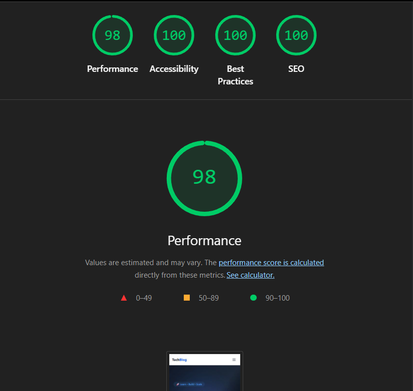
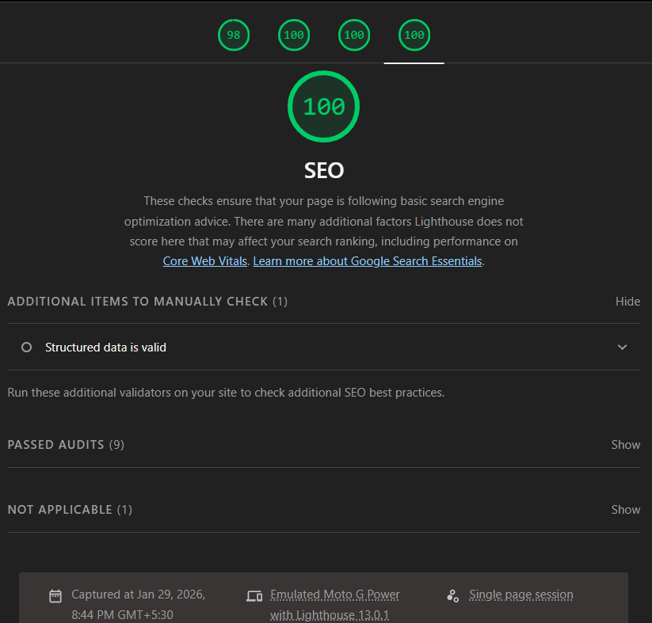
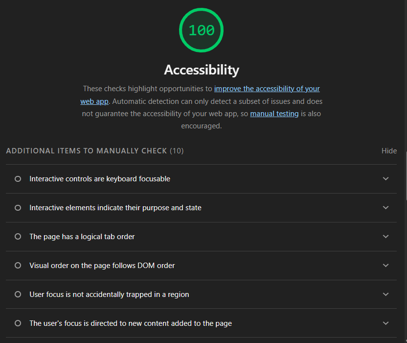
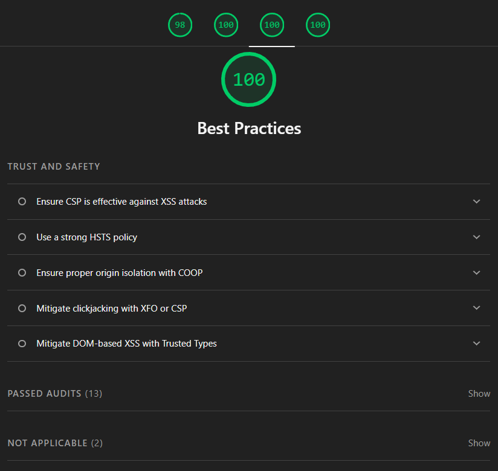

# 🚀 Tech Blog Application

A modern, responsive **Tech Blog** built using **React + Tailwind CSS**, focused on performance, accessibility, SEO, and clean UI/UX.  
The application supports article listing, search, category filtering, and modal-based article reading.

---

## 📸 Lighthouse Audit Results

All Lighthouse audits were run on a **production build**.

### Performance


### SEO


### Accessibility


### Best Practices


**Target Scores**
- Performance: **90+**
- Accessibility: **85+**
- Best Practices: **90+**
- SEO: **95+**

---

## 🧠 SEO Strategy

### Meta Tags
- Page title (`<title>`) with max 60 characters
- Meta description (`<meta name="description">`) with max 160 characters
- Open Graph tags (`og:title`, `og:description`, `og:image`, `og:url`)
- Twitter Card tags (`summary_large_image`)
- Dynamic meta handling using `react-helmet-async`

### Structured Data
- WebSite schema on homepage
- BlogPosting (Article) schema on blog post pages

### Semantic HTML
- Used semantic tags: `<header>`, `<nav>`, `<main>`, `<section>`, `<article>`, `<footer>`
- Single `<h1>` per page
- Proper heading hierarchy (`h1 → h2 → h3`)
- Accessible buttons and landmarks

---

## 🖼 Image Optimization

- Fixed image dimensions to prevent layout shift (CLS)
- Lazy loading using `loading="lazy"`
- Optimized image sizes
- Consistent aspect ratios for article cards
- Open Graph images sized at 1200 × 630 px

---

## ⚡ Performance Optimizations

- Lighthouse tested on production build only
- Removed duplicate and render-blocking CSS
- Tailwind CSS optimized via Vite
- Avoided forced reflows and unnecessary DOM reads
- Preconnected external APIs
- Minimal JavaScript execution on initial load

---

## 🔍 Search & Filter Implementation

### Search
- Search by article title, description, and content
- Live result count display
- Clear (❌) button for better UX
- "No results found" message

### Category Filter
- Categories generated dynamically from API data
- Active category highlighting
- Combined filtering with search functionality

---

## 🧩 Article Interaction

- Click any article to open full content in a modal
- Modal can be closed by:
  - Close (❌) button
  - ESC key
  - Clicking outside the modal
- Accessible and keyboard-friendly
- Clean typography for readability

---

## ⚠️ Challenges Faced

- Fixing render-blocking CSS warnings
- Resolving accessibility issues for icon-only buttons
- Improving contrast ratios for dark mode UI
- Correctly serving `robots.txt` and `sitemap.xml`
- Handling Lighthouse warnings caused by dev tools

---

## 🛠 Technologies Used

- React
- Vite
- Tailwind CSS
- JavaScript (ES6+)
- react-helmet-async
- Lighthouse
- HTML5 & CSS3
- REST API (SlingAcademy sample blog API)

---

## 📂 Project Structure

```txt
/public
  ├── robots.txt
  ├── sitemap.xml
  └── og-image.png

/screenshots
  ├── lighthouse-performance.png
  ├── lighthouse-accessibility.png
  ├── lighthouse-best-practices.png
  └── lighthouse-seo.png
